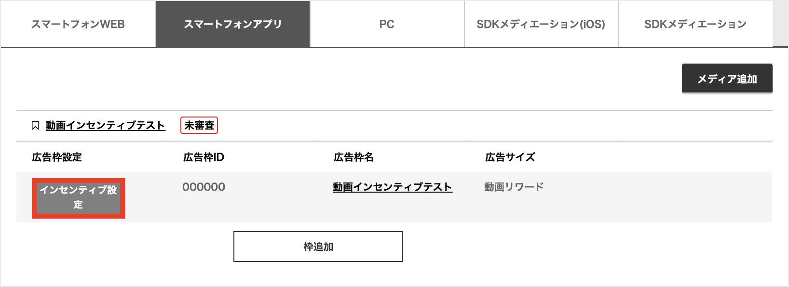
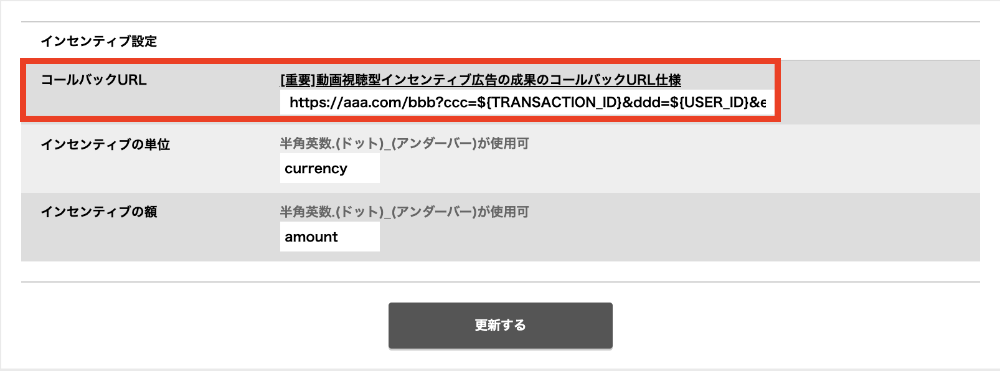

# 動画インセンティブ付与をコールバックURLへ通知する

adstirでは、インセンティブ付与の通知を、任意のコールバックURLに行うことが可能です。
付与するインセンティブの単位と額は、任意の値に変更可能です。

管理画面より設定することができます。
広告枠一覧のインセンティブ設定より設定ができます。

弊社のコールバック仕様は、置換文字列方式となっております。

| 置換文字列 	| 内容 | 必須
|---|---|:-:|
| ${TRANSACTION_ID} | adstir成果ID | o |
| ${USER_ID} 	    | メディアユーザーID | o |
| ${CURRENCY} 	    | インセンティブの単位 | - |
| ${AMOUNT} 	    | インセンティブの額 | - |
| ${IFA} 	        | Apple IDFA/Google Play Advertising ID (正常に取れない場合もあります) | - |

> 例： http(s)://aaa.com/bbb?ccc=${TRANSACTION_ID}&ddd=${USER_ID}&eee=${CURRENCY}&fff=${AMOUNT}

コールバックURLは大変長くなりますので、コールバックサーバーは長いURLを受け付けられるようにしておいてください。
`成果を正常に受け取れた場合は、200 OKを返す`ように実装してください。

## 注意事項

コールバックは重複して発行されることがありますので、必ずadstir成果IDに対してユニーク処理を実装するようにしてください。
IFAは正常に取れない場合がありますので、必ずUSER_IDで成果の付与は行ってください。
コールバックサーバの呼び出しは、60秒でタイムアウトするよう設定しています。
タイムアウトや、サーバー接続で200 OK以外のレスポンスが返された場合、`1分おきに最大10回リトライ`をします。 

