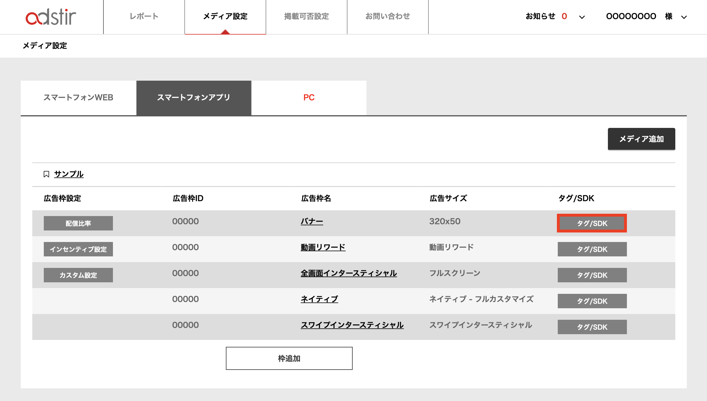
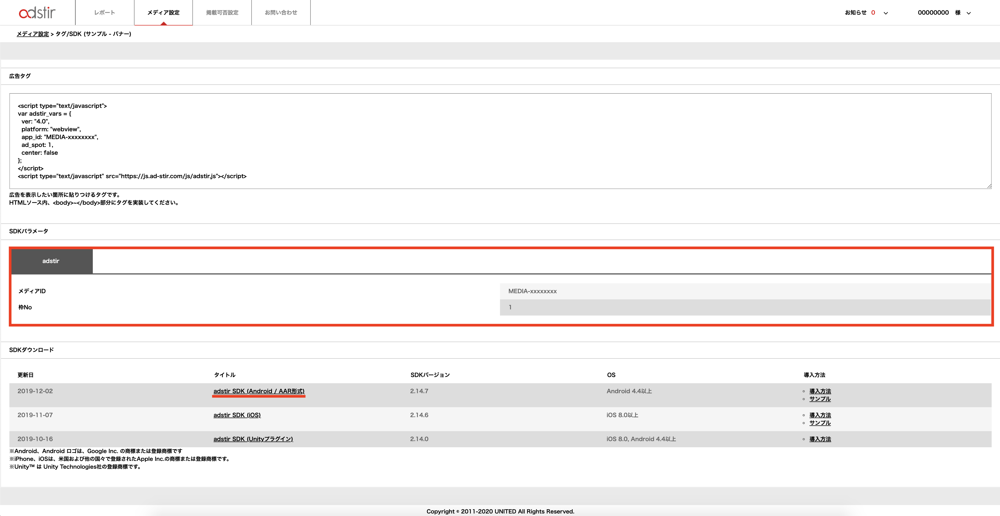
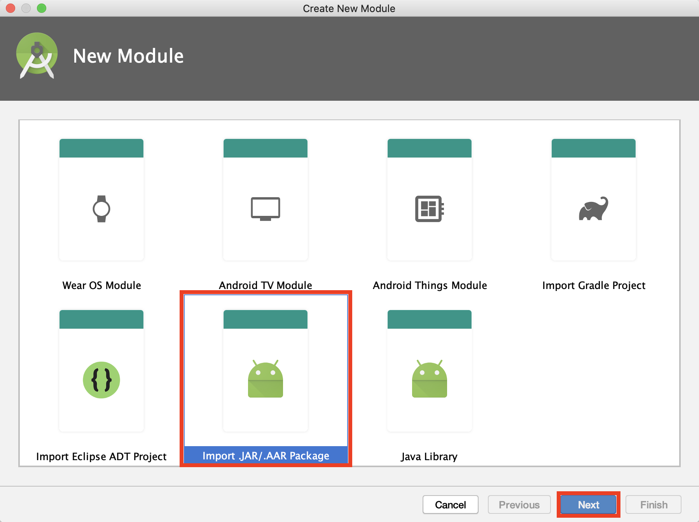

# SDKの手動組み込み

## SDKの準備
1. 管理画面にログインして、対象の枠の「タグ/SDK」を選択してください。


2. 「SDKダウンロード」より「AdStir SDK(iOS)」をダウンロードしてください。

3. 「SDKパラメータ」より「メディアID」および「枠No」を取得してください。


## プロジェクトへのadstir SDKの追加

以前のバージョンのSDKを利用されている場合は、必ず関連するファイルを全て削除してください。

1. [SDKの準備](#sdkの準備)でダウンロードした圧縮ファイルを展開してください。
1. 展開したフォルダの中にある .aarファイルを「File -> New -> New Module -> Import JAR / AAR Package」よりインポートしてください。

1. 「File -> Project Structure -> Dependencies -> app」に、2.でインポートしたモジュールを追加してください。


## Google Play Servicesの追加
本SDKでは、[Google Play services](https://developer.android.com/google/play-services/index.html)の機能を使用しています。  
アプリケーションレベルのbuild.gradleに依存関係を設定します。

```groovy hl_lines="1 3"
dependencies {
    implementation 'com.google.android.gms:play-services-ads-identifier:x.x.x'
}
```