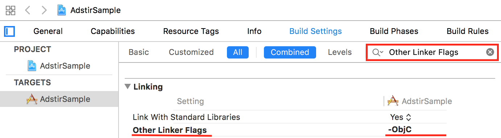

# SDKの手動組み込み

## SDKの準備
1. 管理画面にログインして、対象の枠の「タグ/SDK」を選択してください。

2. 「SDKダウンロード」より「AdStir SDK(iOS)」をダウンロードしてください。

3. 「SDKパラメータ」より「メディアID」および「枠No」を取得してください。

## プロジェクトへのadstir SDKの追加

以前のバージョンのSDKを利用されている場合は、必ず関連するファイルを全て削除してください。  

1. [SDKの準備](#sdkの準備)でダウンロードした圧縮ファイルを展開してください。
1. 展開したフォルダの中にあるAdstirAds.frameworkを、プロジェクト内の任意の箇所にドラッグ&ドロップします。
1. `Copy items if needed`にチェックを入れます。
1. `Add to targets`欄で、adstir SDKを利用するすべてのターゲットにチェックを入れます。
1. `Finish`をクリックします。

### 対応提携ネットワークのライブラリの追加

配布パッケージ内にある対応提携ネットワーク名のディレクトリを、プロジェクト内の任意のドラッグ&ドロップすることで追加ができます。

1. 対応提携ネットワークのディレクトリを、プロジェクト内の任意の箇所にドラッグ&ドロップします。  
このディレクトリには、メディエーションアダプターと対応提携ネットワークの必要ライブラリが含まれています。  
すでに該当の対応提携ネットワークを組み込まれている場合、重複して組み込むと不具合が発生することがございますので、ご注意下さい。
1. `Copy items if needed`にチェックを入れます。
1. `Add to targets`欄で、adstir SDKを利用するすべてのターゲットにチェックを入れます。
1. `Finish`をクリックします。

#### ビルド設定の変更

1. プロジェクトファイル設定画面を開きます
1. 動画広告を組み込むビルドターゲットを選択します
1. `Build Target`タブを選択します
1. 画面右側の検索窓に`Other Linker Flags`と入力し、検索します
1. `Other Linker Flags`欄に、`-ObjC`と設定します  
提携アドネットワークのSDKを呼び出すためには、この設定が必須となり、設定がされていない場合は、案件切れ扱いとなってしまいます
1. 組み込む対象の全てのビルドターゲットに、同じ設定を行います  
もしくは、この設定はプロジェクト単位で設定することも可能です

#### 依存Framework/Libraryの追加

1. プロジェクトファイル設定画面を開きます
1. 動画広告を組み込むビルドターゲットを選択します
1. **Build Phases**タブを選択します
1. `Link Binary With Libraries`を開き、下記のFramework/Libraryを追加します

名前|ステータス
----|----
MediaPlayer.framework|Required
MessageUI.framework|Required
Social.framework|Required
StoreKit.framework|Required
libz.1.2.5.tbd|Required
WebKit.framework|Optional
CoreMotion.framework[^1]|Required
CoreGraphics.framework|Required
ImageIO.framework|Required
MobileCoreServices.framework|Required
libc++.tbd|Required
UIKit.framework|Required
libsqlite3.tbd|Required
CoreLocation.framework[^2]|Required
libresolv.9.tbd | Required
libz.tbd | Required

[^1]: CoreMotion.frameworkはTapJoy、TikTokを利用する際に設定してください。  
[^2]: CoreLocation.frameworkはMobvista、TikTokを利用する際に設定してください。  
